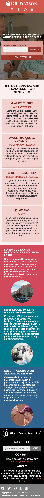

# Capstone Project: HTML & CSS

> This is a capstone project for the HTML and CSS section of the Technical Skills Curriculum.

[Project presentation](https://youtu.be/ilz0rF5jAj4)

A capstone project is the closing project that students will solo-perform. Its goal is to assess the student's technical and professional skills from the course that it is closing. For this project, the student should develop a concept, responsive, mobile-first web page.

## Design Considerations

This project's approach was thinking of it as a client reached with an idea for its website. From that idea, I gave myself creative freedom, so it will not look 100% the same. It will contain all features and sections, but they may look and feel different.

Some small details may change for any of the following reasons:
- The original color schema is not in-line with the subject. For this, I provide an alternative color schema that fits better.
- There are some changes in color, backgrounds, borders, shadows, and tints to improve contrast and usability; and draw the user's attention to the intended part of the site.
- The footer bar is over-simplified on purpose because a heavily filled and high-contrast footer may distract the user from reaching the core information, which is the ultimate goal.
- When designing the results cards, I decided to make them similar to Bootstrap cards because users *may want* a sneak peek of the actual content to click the result, rather than a picture and a name.
  - The original design uses a background image with white text in the middle because a sneak peeks is not as valuable as, for example, the distance from the user to the school.
- The filter form is hidden inside a `details` tag closed by default because it may draw the user's attention earlier than expected.
  - I want the user to navigate the results before filtering them, but without forcing them to reach the bottom of the page to find the filter form.
- Inside the details page, I added a card that shows the complete information from the sneak peek. This feature is present because the sneak-peek drew the user's attention in the results, and they may want to find the full details sooner rather than later.
- Inside the details page, you may find some text which resembles a blog entry or an article.
  - This is also intentional because the subject (rare diseases) often requires investigation. Giving institutions a space to express what they are doing or who they are may help connect the user to the institution.
- If the user is interested enough, it can expose the information card with valuable details compacted in a card; but is not shown by default. Only users interested enough may want to see the information card.
  - The information card contains the details for filtering results, which offers a valuable piece of information, yet we don't want users not interested to see the `Apply` button.
- One of the essential details of the results, just after the details card, is the exact location. Users may find interesting information and have a will to apply, but they may stop when they see the precise location (because it may not be convenient for them).
- From the point above, the business contact information is way to the bottom. It should show only when the user knows that the exact location may not be an impediment or may want to gather more details directly from the institution.

## Built With

- NoTengoBattery's [`html-css-template`](https://github.com/NoTengoBattery/html-css-template) template and it's automatization scripts
- [Bootstrap](https://getbootstrap.com/)
- [HTML](https://www.w3.org/html/)
- [SCSS/SASS](https://sass-lang.com/)
- Free assets sites
  - [Adobe Fonts](https://fonts.adobe.com/)
  - [Coolors](https://coolors.co/)
  - [Coverr](https://coverr.co/)
  - [FontAwesome](https://fontawesome.com/)
  - [Google Fonts](https://fonts.google.com/)
  - [Unsplash](https://unsplash.com/)

## Live Demo

Deployed version on [GitHub Pages](https://notengobattery.github.io/capstone-html/)

- Show results: click on the search button either in the navbar or on the landing cover
- Show details page: click on any results card

### Original Design Version (orange theme)

Because of the subject that this page discusses, using a funny orange color with big, comic icons does not serve the purpose. For this reason, I created an alternative theme with my selection of colors. The links inside the page do not work due to the limitations of the service used to provide the demo, but you can browse them, one by one, following the links below.

- [Landing](https://htmlpreview.github.io/?https://github.com/NoTengoBattery/capstone-html/blob/original-design/index.html)
- [Results](https://htmlpreview.github.io/?https://github.com/NoTengoBattery/capstone-html/blob/original-design/src/html/results.html)
- [Details](https://htmlpreview.github.io/?https://github.com/NoTengoBattery/capstone-html/blob/original-design/src/html/detail.html)

> Note that while this service is useful, it is not as fast as GitHub pages, so you will experience jitter while the stylesheet reloads. Some web page details will not render correctly, but this is the same as the GitHub page, just with the different color schema. **IT MAY TAKE MINUTES TO LOAD THE STYLESHEET**.

## Getting Started

For this project, you only need to follow the link to the live demo. If you need a copy of this project in your local environment, you can clone this repository using `git`.

- Open your terminal
- Type `git clone https://github.com/NoTengoBattery/capstone-html.git`

You can also use the green "Code" button on GitHub to download a `.zip` file with the source code.

- Check this [StackOverflow](https://stackoverflow.com/a/2751270) answer.

### Usage

For testing and using this project, you need to open the `index.html` file in your browser at the repository root. No other special requirements or tools are required.

## Authors

👤 **Oever González**

- GitHub: [@NoTengoBattery](https://github.com/NoTengoBattery)
- Twitter: [@NoTengoBattery](https://twitter.com/NoTengoBattery)
- LinkedIn: [Oever González](https://linkedin.com/in/NoTengoBattery)

## 🤝 Contributing

Contributions, issues, and feature requests are welcome!

Feel free to check the [issues page](https://github.com/NoTengoBattery/capstone-html/issues).

## Show your support

Give a ⭐️ if you like this project!

## Acknowledgments

- [Mathew Njuguna](https://www.behance.net/mathewnjuguna)
- [RedHat](https://www.redhat.com/) for its astonishing [Liberation](https://www.redhat.com/en/blog/liberation-fonts) font family
- [Fabrizio Bianchi](https://www.instagram.com/_fbrz) for his excellent [Coolors](https://coolors.co/) tool
- [Leyland Kirby](https://leylandkirby.bandcamp.com/) (a.k.a [The Caretaker](https://thecaretaker.bandcamp.com/)) for his amazing royality-free ambient music

## 📝 License

This project is [X11](https://spdx.org/licenses/X11.html) licensed.
